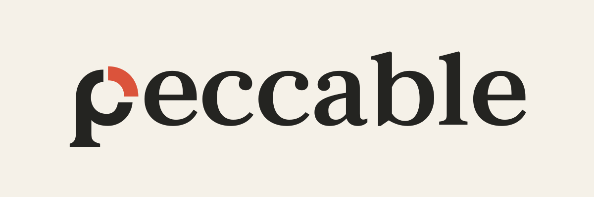

<p align="center">
  
</p>

# Peccable — autonomous fork

Peccable is a deliberately divergent fork of Impeccable—with a name that admits we can get things wrong. Upstream was created by Paul Bakaus and originally inspired by Anthropic's frontend-design skill. This fork retains frontend design craft while replacing the command-driven product and its runtime with **one portable, standards-compliant Agent Skill** named `peccable`.

The agent infers context from your task, repository, existing documentation, interface, and ongoing direction. It decides which design interventions are useful within the assignment; you do not select a design command, initialize a project, or complete a workshop. No runtime build, engine download, account, private service, or development toolchain is required to use the skill.

## Install

Choose an Agent Skills-compatible harness and find its configured skills directory. Discovery, activation, and permissions depend on that harness; copying these files does **not** guarantee that every harness automatically loads them.

From this repository's root, set `SKILLS_DIR` to that configured directory, then copy the entire authored distribution directory:

```sh
export SKILLS_DIR='/absolute/path/to/configured/skills'
(
    set -eu
    : "${SKILLS_DIR:?Set SKILLS_DIR to your configured skills directory}"
    mkdir -p "$SKILLS_DIR"
    destination="$SKILLS_DIR/peccable"
    if ! mkdir "$destination"; then
        printf '%s\n' "Installation stopped: cannot create a new $destination directory; existing destinations are not overwritten." >&2
        exit 1
    fi
    cp -R skills/peccable/. "$destination/"
)
```

The installed directory must be named `peccable`, matching the skill's frontmatter name. If that destination already exists, the installation stops without replacing it. Review and move an older installation deliberately before installing again. Follow your harness's documented discovery or activation procedure; if it supports explicitly loading a skill file, point it at the installed `peccable/SKILL.md`.

Everything shipped lives in `skills/peccable/`: currently `SKILL.md`, `references/`, `LICENSE`, and `NOTICE.md`. Copying the entire directory also includes any future referenced scripts or assets added there. Root maintenance scripts, tests, specification, and documentation do not ship and are not runtime dependencies; the current skill calls no scripts.

## Use ordinary tasks

Once the harness has loaded the skill, describe the outcome you want, for example:

- “Make this checkout easier to complete on a phone; preserve the existing brand.”
- “Build a distinctive landing page for this product using the facts already in the repository.”
- “Improve the settings screen's hierarchy, keyboard navigation, and error states.”
- “Review this onboarding flow and propose changes only; do not edit code.”

The agent chooses relevant guidance and actions itself. It can simplify a layout, strengthen typography, improve copy, repair interaction states, or tune motion without asking you to choose a technique. Accessibility, responsiveness, functionality, and performance are part of the work, not separate opt-in modes.

### Authority and limits

Autonomy is bounded by the assignment and user intent. The agent respects planning-only requests, preserves a coherent existing identity, and does not treat design work as permission to deploy, destroy data, expand scope, or invent product facts. It asks user-intent questions only when a material gap in intent, facts, or authority remains unresolved after inspecting available context—not for routine design decisions or blanket approval at each step.

Iteration is bounded by the task's acceptance criteria and available evidence, rather than endless polishing or an arbitrary number of passes. The agent reports what it actually inspected and checked, and identifies evidence it could not obtain. The skill is guidance for the host agent, not an enforcement engine or a guarantee of visual quality.

## Architecture

[skills/peccable/SKILL.md](skills/peccable/SKILL.md) is the only entry point and source of behavioral authority. It loads focused references only when needed:

| Reference | Focus |
| --- | --- |
| [Workflow](skills/peccable/references/workflow.md) | Context inference, decisions, implementation, and bounded iteration |
| [Quality](skills/peccable/references/quality.md) | Accessibility, responsiveness, states, and evidence |
| [Typography](skills/peccable/references/typography.md) | Type choice, hierarchy, readability, and rhythm |
| [Color](skills/peccable/references/color.md) | Intentional palettes, contrast, and semantic color |
| [Layout](skills/peccable/references/layout.md) | Composition, spacing, density, and responsive structure |
| [Motion](skills/peccable/references/motion.md) | Purposeful animation and reduced-motion behavior |
| [Interaction](skills/peccable/references/interaction.md) | Controls, navigation, feedback, and recovery |
| [Content](skills/peccable/references/content.md) | Clear interface copy and truthful product communication |
| [Systems](skills/peccable/references/systems.md) | Existing identity, reusable components, and tokens |
| [Performance](skills/peccable/references/performance.md) | Efficient frontend implementation and rendering |
| [Platforms](skills/peccable/references/platforms.md) | Web and native platform conventions |

These are authored Markdown sources, not generated replicas or provider adapters. There are no required product/design documents or hidden project-state files. Existing project documents remain useful evidence when present.

`skills/peccable/` is the authored, installable distribution source, not a generated output. Its isolation from repository-level `agents/skills/` and `.agents/skills/` discovery paths avoids intentionally auto-loading our frontend skill while maintaining skills. The Agent Skills standard does not mandate a repository layout, and this placement cannot guarantee how every harness discovers or activates skills.

```text
skills/peccable/          # shipped: copy this entire directory
    SKILL.md
    references/          # eleven focused references
    LICENSE              # identical copy of the root license
    NOTICE.md
scripts/check.py         # repository maintenance only
tests/                   # repository maintenance only
.github/                 # repository maintenance only
SKILLS_SPEC.md           # retained specification; not shipped
README.md, AGENTS.md,
CHANGELOG.md             # repository documentation; not shipped
LICENSE                  # unchanged repository license
```

### What this fork removes

The old CLI and installer, deterministic detector engine, browser extension and live-variant tooling, provider integrations, generated distributions, command menus and aliases, and initialization/state machinery are not included. This fork does not scan a page with the old detector, supply browser automation, or provision a model provider. An agent may use tools already available in its harness, but the skill does not install them.

### Assessment behind the cutover

The assessment judged **3,357 text files**: **520 keep**, **1,214 adapt**, **369 mixed**, **1,183 remove**, and **71 other**. There were **33 deterministic exclusions** and **209 capped or truncated assessments**. These are assessment counts, not a claim about the final payload or a complete review of every byte.

- **Keep:** transferable design craft and useful domain knowledge.
- **Adapt:** useful guidance tied to commands, workshops, rigid aesthetic rules, or mandatory project state; retain its purpose within context-sensitive autonomous decisions.
- **Mixed:** separate reusable craft from obsolete orchestration and packaging.
- **Remove:** the runtime, integration, replication, and maintenance architecture that this fork no longer ships.
- **Other:** material requiring separate disposition rather than a craft verdict.

Verdicts were advisory. Canonical contracts were manually confirmed before the cutover. Generated replicas were removed because the architecture now has one source, not because their design craft had no value.

## Maintainer validation

There is no runtime build or generation step. From the repository root, maintainers run:

```sh
python3 scripts/check.py
python3 -m unittest discover -s tests
uvx --from 'git+https://github.com/agentskills/agentskills.git@69ef37e9424c0a7ea9dd2293b559e43ec8176379#subdirectory=skills-ref' skills-ref validate "$PWD/skills/peccable"
```

The portable-resource checker defaults to `skills/peccable/` under the repository root derived from its own location, independent of the working directory. Its optional path checks any installed payload without requiring repository maintenance files:

```sh
python3 scripts/check.py "$SKILLS_DIR/peccable"
```

The checker validates portable resource integrity; it does not reimplement YAML or Agent Skills specification validation. The boundary regression tests are isolated. The official `skills-ref` validator is pinned to the revision above; Python 3 and `uvx` are maintainer tooling only, not installation or usage prerequisites. Structural checks do not prove design quality or universal harness compatibility.

Pass an absolute skill-directory path to the pinned reference validator: a literal `.` is interpreted with an empty directory name and fails its name-matching check. The copy installation above creates an exclusive destination, copies only the complete shipping directory, and refuses existing destinations without changing their contents.

The documented whole-directory installation has been exercised in a configured directory containing spaces, including refusal to overwrite an existing installation. The installed `peccable` payload passed resource integrity, official validation, metadata reading, and discovery-prompt generation without repository maintenance files.

[AGENTS.md](AGENTS.md) defines contribution and verification policy. [CHANGELOG.md](CHANGELOG.md) records this unreleased cutover. [SKILLS_SPEC.md](SKILLS_SPEC.md) is the retained specification reference.

## Attribution and license

Upstream Impeccable was created by [Paul Bakaus](https://www.paulbakaus.com), with origins in Anthropic's [frontend-design](https://github.com/anthropics/skills/tree/main/skills/frontend-design). The root [LICENSE](LICENSE) remains unchanged, with an identical [bundled copy](skills/peccable/LICENSE) for portable installations. [NOTICE.md](skills/peccable/NOTICE.md) preserves upstream attribution and the MIT notice for platform guidance adapted from ehmo's platform-design-skills.
